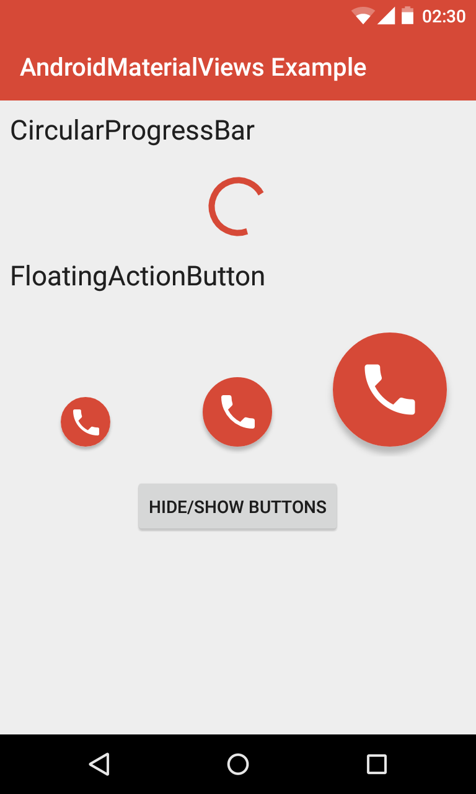

# AndroidMaterialViews - README

[](https://android-arsenal.com/api?level=14) [](https://opensource.org/licenses/Apache-2.0) [](https://www.paypal.com/cgi-bin/webscr?cmd=_s-xclick&hosted_button_id=X75YSLEJV3DWE)

"AndroidMaterialViews" is an Android-library, which provides various views, which are part of Android's Material Design guidelines, but which are not provided by the official Android SDK. The library's views can also be used on pre-Lollipop 
devices.



The library provides the following views:

- A `CircularProgressBar`, which allows to visualize an indeterminate progress as an animated circle.
- A `FloatingActionButton`, which is a round, colored button with a shadow and an icon. The button supports to become shown or hidden in an animated manner.
- A `Chip`, which acts like a tag, containing a text and optionally an icon and a close button.

## License Agreement

This project is distributed under the Apache License version 2.0. For further information about this license agreement's content please refer to its full version, which is available at http://www.apache.org/licenses/LICENSE-2.0.txt.

Prior to version 2.0.1 this library was distributed under the GNU Lesser General Public License version 3.0 (GLPLv3).

## Download

The latest release of this library can be downloaded as a zip archive from the download section of the project's Github page, which is available [here](https://github.com/michael-rapp/AndroidMaterialViews/releases). Furthermore, the library's source code is available as a Git repository, which can be cloned using the URL https://github.com/michael-rapp/AndroidMaterialViews.git.

Alternatively, the library can be added to your Android app as a Gradle dependency by adding the following to the respective module's `build.gradle` file:

```groovy
dependencies {
    compile 'com.github.michael-rapp:android-material-views:2.1.5'
}
```

Before version 2.0.0 this project was hosted on [Sourceforge](https://sourceforge.net/projects/androidmaterialviews). These older versions used the legacy Eclipse ADT folder structure and are not available as Gradle artifacts.

## Examples

The following examples provide a quick overview on how to use the views, which are provided by the library, in your own Android app. This project also contains the source code of an example app, which implements an use case of the library for demonstration purposes, as well as a more detailed documentation and auto-generated javadoc files.

### CircularProgressBar

The XML code below shows how the view `CircularProgressBar` can be added to a XML layout resource. This example contains all of the view's custom attributes.

```xml
<?xml version="1.0" encoding="utf-8"?> 
<RelativeLayout xmlns:android="http://schemas.android.com/apk/res/android" 
    android:layout_width="match_parent" 
    android:layout_height="match_parent" >

    <de.mrapp.android.view.CircularProgressBar 
        android:id="@+id/circular_progress_bar" 
        android:layout_width="@dimen/circular_progress_bar_size_normal" 
        android:layout_height="@dimen/circular_progress_bar_size_normal" 
        android:color="@color/circular_progress_bar_color" 
        android:thickness="@dimen/circular_progress_bar_thickness_normal" /> 

</RelativeLayout>
```

### FloatingActionButton

The following example demonstrates how a `FloatingActionButton` can be declared within a XML layout resource. The example contains all of the view's custom attributes.

```xml
<?xml version="1.0" encoding="utf-8"?> 
<RelativeLayout xmlns:android="http://schemas.android.com/apk/res/android" 
    xmlns:custom="http://schemas.android.com/apk/res-auto" 
    android:layout_width="match_parent" 
    android:layout_height="match_parent" >

    <de.mrapp.android.view.FloatingActionButton 
        android:id="@+id/floating_action_button" 
        android:layout_width="wrap_content" 
        android:layout_height="wrap_content" 
        android:color="@color/floating_action_button_color" 
        android:icon="@drawable/floating_action_button_icon" 
        custom:size="normal" 
        custom:activatedColor="@color/floating_action_button_activated_color" 
        custom:pressedColor="@color/floating_action_button_pressed_color" 
        custom:disabledColor="@color/floating_action_button_disabled_color" 
        custom:visibilityAnimationDuration="500" /> 

</RelativeLayout>
```

## Chip

The following XML code shows how a `Chip` can be added to a XML resource. The example contains a text as well as an icon and a close button. By using a Chip's `addCloseListener`-method, listeners can be registered to be notified when a chip has been closed.


```xml
<?xml version="1.0" encoding="utf-8"?> 
<RelativeLayout xmlns:android="http://schemas.android.com/apk/res/android" 
    xmlns:custom="http://schemas.android.com/apk/res-auto" 
    android:layout_width="match_parent" 
    android:layout_height="match_parent" >

    <de.mrapp.android.view.Chip 
        android:id="@+id/chip" 
        android:layout_width="wrap_content" 
        android:layout_height="wrap_content"
        android:text="@string/chip_text"
        android:color="@color/chip_color_" 
        android:icon="@drawable/chip_icon" /> 

</RelativeLayout>
```

If a dark theme should be used by a `Chip`, this can be achieved by adding a `style`-tag like shown in the following:

```xml
<de.mrapp.android.view.Chip 
    style="@style/Chip"
    ...
```

## Contact information

For personal feedback or questions feel free to contact me via the mail address, which is mentioned on my [Github profile](https://github.com/michael-rapp). If you have found any bugs or want to post a feature request please use the [bugtracker](https://github.com/michael-rapp/AndroidMaterialViews/issues) to report them.
